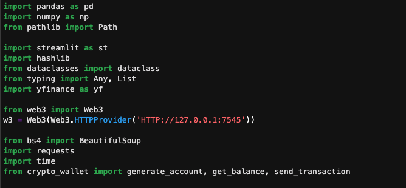

# Crowdfunding--Send-it-my-way
A crypto/blockchain based endevour that aims at bringhing more tranparency and efficiency to the HOA payments and decision making within a housing community. While the payments made via a blockchain technology(ethereum) makes  payment process easy, while cutting middle-person out, voting on he block chain plaform makes the process even more democratic as there is no noytion of false play. By inegrating the payment of HOA dues and voting rights, the platform also shows an example of "taxation with representation".

---

## Technology
The codes of the "Send it my way" platform were coded in Python with different Web3 based functions, while we used solidty to compose any blockchain based contracts. Solidity contracts were created on RemixIde. Ganache provided a virtual sandbox to run a ethereum environment emulation. Similarly, Streamlit was used for easy interface with the user. The citations/ links for the other codes that we had to borrow will be linked below.

---
## Installations
Install Streamlit (On Terminal/Bash)
 * Pip install streamlit

Install W3 (On Terminal/Bash)
 * pip install Web3
RemixIde can be used on the internet.

Install Ganache on the comupting device.

Installment of Metamask is suggested

Imports:
The following imports are necesasry for runing the platform:

---
How the current platform works:

* Payments are due based on the housing property valuations
* Payments/HOA contributions are essential parts of the community budget.
* The platform allows interactive selection of your property, and details(Housing valuation, HOA Dues, etc.)
* The platform actively interacts with the market and provide the current price of the ethereum for user convenience.
* Payment can be made with just  ‘click’.
* Transaction creates a payment on the blockchain, and creates a hash validating the payment authorization
* User’s crypto account is already linked to the platform.
  
* Secured voting using blockchain platform
* Payment of HOA secures voting right
* One vote per issue regardless of the HOA payment.
* Voting process takes place using blockchain platform.
* Uses streamlit for more convenient user interface
* Secured under blockchain

---
### Citations/Links:

crypto_price_cnvrtr
source:https://betterprogramming.pub/get-the-price-of-cryptocurrencies-in-real-time-using-python-cdaf07516479

---
### Contributors:
  Babin Shrestha
  David Paquiot 
  Feier Ou 
  Winnie Mei
  Matthew Fields
